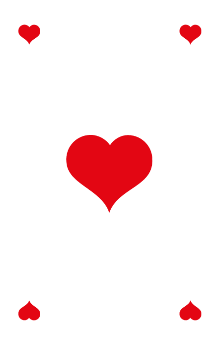
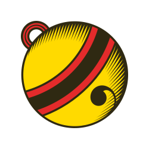
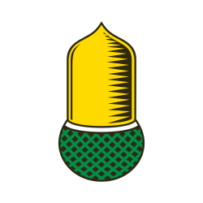

# Jass App ♥️

Eine Flutter-App für das Schweizer Kartenspiel **Jass** – spielbar auf Android.

---

## Download

<p align="center">
  <a href="https://github.com/Flavio-art/Jass_App/releases/latest/download/app-release.apk">
    
  </a>
</p>

> **Android 8.0+** · APK öffnen, einmalig „Unbekannte Quelle" erlauben, fertig.

[📋 Alle Releases & Versionshistorie](https://github.com/Flavio-art/Jass_App/releases)

---

## Spieltypen

###  Schieber
Klassischer Schweizer Schieber für 2 Teams (Süd+Nord vs. West+Ost).

- 5 Varianten wählbar: Trumpf Schwarz (×1), Trumpf Rot (×2), Obenabe (×3), Undenufe (×3), Slalom (×4)
- Multiplikatoren konfigurierbar im Hauptmenü
- Zielpunkte wählbar: 1000 – 5000
- Schieben zum Partner einmalig möglich

### 🎯 Differenzler
Individuelles Spiel über 4 Runden.

- Jeder Spieler sagt vor der Runde seine erwarteten Stichpunkte vorher
- Strafe = |Vorhersage − tatsächliche Punkte|
- Spieler mit der geringsten Gesamtstrafe gewinnt

### ✂️ Friseur Team
Strategie-Modus für 2 Teams über 20 Runden.

- Jedes Team muss alle 10 Varianten je einmal ansagen
- Trumpfgruppen (Schwarz/Rot) müssen je einmal als Oben und einmal als Unten gespielt werden
- Das Team mit den meisten Punkten nach 20 Runden gewinnt

### ✂️ Friseur Solo (Wunschkarte)
Solo-Variante über 20–40 Runden.

- Jeder Spieler sagt seine 10 Varianten einzeln an
- Wunschkarte: Ansager wünscht eine Karte – wer sie hat, ist geheimer Partner
- Partner wird aufgedeckt sobald die Wunschkarte gespielt wird
- Bis zu 2× Schieben möglich; nach 2× ist der Ansager **Im Loch** 🕳️

---

## Spielvarianten (10)

| Variante | Beschreibung | Besonderheit |
|----------|-------------|--------------|
| ♠♣ /   Trumpf Schwarz | Schaufeln/Kreuz bzw. Schellen/Schilten | Buur › Näll › Ass › … |
| ♥️♦️ /   Trumpf Rot | Herz/Ecken bzw. Rosen/Eichel | ×2 Punkte |
| ⬆️ Trumpf Unten | Trumpf mit umgekehrter Reihenfolge | Sechs = 11 Pkt |
| ⬇️ Obenabe | Kein Trumpf, Ass gewinnt | Achter = 8 Pkt |
| ⬆️ Undenufe | Kein Trumpf, Sechs gewinnt | Sechs = 11 Pkt, Achter = 8 Pkt |
| 〰️ Slalom | Abwechselnd Obenabe / Undenufe | – |
| 🐘 Elefant | 3× Oben · 3× Unten · 3× Trumpf | Trumpffarbe ab Stich 7 |
| 😶 Misere | Ziel: möglichst wenig Punkte | Wertung: 157 − Punkte |
| 👑 Alles Trumpf | Angespielte Farbe als Trumpf | Nur Buur / Näll / König zählen |
| 🐑 Schafkopf | Damen + Achter + Trumpffarbe = Trumpf | Zehner schlägt Ass |
| 💣 Molotof | Modus durch ersten Abwurf bestimmt | Ziel: wenig Punkte |

> Schieber nutzt nur: Trumpf Schwarz/Rot, Obenabe, Undenufe, Slalom

---

## Features

- **Zwei Kartensets**: Französisch (♠♣♥️♦️) und Deutsch ( Schellen ·  Rosen ·  Eichel ·  Schilten)
- **KI-Gegner** mit Monte-Carlo-Simulation + neuronales Netz für Modus-Wahl + intelligente Abwurfstrategie
- **KI-Moduswahl mit Wunschkarte**: Im Friseur Solo bewertet die KI jeden Modus mit idealer Wunschkarte + besten 9 Karten
- **Im-Loch-Boost**: Misère/Molotof werden bei schlechten Händen (2× geschoben) häufiger gewählt als Fallback
- **Dynamisches Schieben**: KI schiebt ~80% am Anfang, ~60% am Ende; in Runde 2 sagen ~10% trotzdem an
- **Zentrale KI-Tuning-Config** (`nn_tuning.dart`): Alle Multiplikatoren und Schwellenwerte an einem Ort
- **Weisen (Wys)**: Kombinationen werden angesagt und automatisch ausgewertet
- **Spielübersicht** 📊: Rundenhistorie und Punktetabelle jederzeit über Topbar abrufbar
- **Schieben-Kommentare**: 50+ lustige Sprüche wenn KI passt, Mitleids-Kommentare bei Runde-2-Ansage, Cadeller-Sprüche bei Glück nach Im Loch
- **Im-Loch-Indikator** 🕳️: Zeigt welcher Spieler nach 2× Schieben spielen muss
- **Vollständiges Regelwerk** direkt in der App (eigener Tab pro Spielmodus)
- **Farbenpflicht** korrekt umgesetzt (inkl. Schafkopf-Sonderregeln)
- **Stich-Timing**: Stich bleibt liegen bis zum Antippen

---

## Kartenwerte

### Trumpfspiel

| Karte | Trumpf | Trumpf Unten | Obenabe / Undenufe |
|-------|:------:|:------------:|:-----------------:|
| Buur (Trumpf-Bauer/Under) | **20** | **20** | 2 |
| Näll (Trumpf-Neun) | **14** | **14** | 0 |
| Ass | 11 | 0 | 11 / 0 |
| Zehner | 10 | 10 | 10 |
| König | 4 | 4 | 4 |
| Dame / Ober | 3 | 3 | 3 |
| Bauer / Under (kein Trumpf) | 2 | 2 | 2 |
| Sechs (Trumpf Unten) | – | **11** | 0 / **11** |
| Achter | 0 | 0 | **8** |

Letzter Stich: **+5 Bonus**. Gesamtpunkte pro Runde: **157**.

---

## Technologie

- **Flutter / Dart** – plattformübergreifend (aktuell Android)
- **Provider** – State Management
- **KI**: Monte-Carlo-Simulation mit Perfect-Information-Rollouts + trainiertes neuronales Netz (Modus-Wahl)
- Karten vollständig in Flutter gezeichnet (keine externen Bild-Assets nötig)

---

## Projektstruktur

```
lib/
├── main.dart
├── models/
│   ├── card_model.dart          # JassCard, Suit, CardValue, CardType
│   ├── deck.dart                # 36-Karten-Deck, Mischen, Austeilen
│   ├── player.dart              # Player, PlayerPosition, sortHand
│   └── game_state.dart          # GameState, GamePhase, GameMode, GameType
├── providers/
│   └── game_provider.dart       # ChangeNotifier, Spiellogik, KI-Steuerung
├── screens/
│   ├── home_screen.dart         # Hauptmenü, Kartenset- & Spieltyp-Auswahl
│   ├── game_screen.dart         # Spielfeld, Overlays, Übersicht
│   ├── splash_screen.dart       # Ladescreen mit Kartenfächer
│   ├── trump_selection_screen.dart  # Spielmodus-Auswahl
│   └── rules_screen.dart        # Vollständiges Regelwerk (4 Tabs)
├── widgets/
│   ├── card_widget.dart         # Karte (gezeichnet in Flutter)
│   ├── player_hand_widget.dart  # Fächer-Layout
│   ├── trick_area_widget.dart   # Stich-Mitte
│   └── score_board_widget.dart  # Punkteanzeige
└── utils/
    ├── game_logic.dart          # Stichgewinner, Farbenpflicht, Punkte
    ├── monte_carlo.dart         # KI Monte-Carlo
    ├── mode_selector.dart       # KI Modus-Wahl (NN + Heuristik)
    ├── nn_model.dart            # Neuronales Netz
    └── nn_tuning.dart           # Zentrale KI-Tuning-Konstanten
```

## Setup & Build

```bash
flutter pub get
flutter run                          # Debug auf verbundenem Gerät
flutter build apk --release          # Release-APK erstellen
flutter test test/simulate_modes_test.dart  # KI-Moduswahl simulieren
```

---

*Built von Flavio mit ♥*
